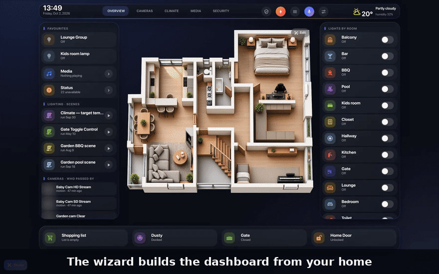

<h1 align="center">Mega Dashboard за Home Assistant</h1>

<p align="center">
  <b>Визуален редактор за таблата в Home Assistant — без YAML.</b><br>
  3D план на дома, наистина цял екран за стенен таблет и киоск, и съветник за настройка.<br>
  Правиш страници, меню, карти и интерактивна 3D карта на дома, виждаш ги на телефон, таблет и компютър и записваш с пълна история.
</p>

<p align="center">
  <a href="https://mega-dashboard.eu/"><b>mega-dashboard.eu</b></a> · by <b>HomeNetcloud.eu</b> · автор: <b>Harry Asar</b>
</p>

<p align="center">
  <a href="https://buymeacoffee.com/harryasarz"></a>
</p>

<p align="center">
  <a href="https://mega-dashboard.eu/#install"></a>
  
  
  <a href="https://buymeacoffee.com/harryasarz"></a>
</p>

<p align="center">
  <a href="https://my.home-assistant.io/redirect/supervisor_app/?app=88eff9af_mega_dashboard&repository_url=https%3A%2F%2Fapps.mega-dashboard.eu%2F"></a>
</p>

<p align="center">
  
</p>

<p align="center">
  <a href="#инсталиране">Инсталиране</a> ·
  <a href="#първи-стъпки">Първи стъпки</a> ·
  <a href="#настройки">Настройки</a> ·
  <a href="#3d-карта">3D карта</a> ·
  <a href="#проблеми">Проблеми</a> ·
  <a href="https://mega-dashboard.eu/">Сайт</a> ·
  <a href="https://github.com/harryasar/mega-dashboard/blob/main/README.md">🇬🇧 English</a>
</p>


## Какво може

| Възможност | Какво прави |
| --- | --- |
| 🎛️ **Студио** | Променяш таблото направо върху таблото. Страниците са от зони (колони, долна лента, изваждащ се панел), а в зоните има **модули** — готови блокове, които сами се пълнят с устройствата ти. Избраният модул има лента (настройки, нагоре/надолу, дублиране, скриване, изтриване), **+** добавя модул между другите, а от **Библиотеката** се довлачва модул с преглед на живо. **Влачиш десния ръб** на модул, за да е по-тесен или по-широк — тесните застават един до друг. Подсказките долу казват какво може да направиш. С мишка и с пръст. |
| 🪄 **Съветник** | Десет кратки екрана правят цяло табло за твоя дом: устройствата, които **ползваш най-много** (от дневника за последните 14 дни — броят се само действията от човек), стаите в твоя ред, страници и модули, картина на дома (с ръководство и готов текст за AI генератор), фон и цвят (с пример какво оцветява акцентът), добавки. *Виж го на таблото* показва резултата преди записване. |
| ✨ **AI асистент** | По желание, в съветника: избираш ChatGPT, Claude, Gemini или Ollama, слагаш **свой ключ** и получаваш гласов асистент с инструкции, написани за твоя дом (стаи, устройства, най-ползвани) — свързан в Home Assistant и, ако искаш, основен Assist конвейер. |
| 🩺 **Проверка на дома** | Батерии под 20%, устройства, които не отговарят, лампи без стая (слагат се в стаи наведнъж) и подсказки, например липсваща прогноза или хора. |
| 🧭 **Ръководство и обиколка** | Кратка обиколка след създаването и ръководство, в което всяка стъпка има *Покажи ми*. |
| 🌳 **Целият дашборд като дърво** | Горно меню, страници, секции и вложени карти (и `custom_fields`, състоянията на `state-switch`, прозорците на browser_mod). Филтър, сгъване и търсене навсякъде с `Ctrl+K`. |
| 👆 **Избери от страницата** | Посочваш карта направо на таблото и редакторът я отваря. Докато избираш, натисканията не включват нищо. |
| 📝 **Обикновени форми** | Всяка карта има раздели *Съдържание*, *Действия*, *Вид* и *Код* — устройство, име, икона, какво става при натискане, цветове и размери, правила по състояние и общи стилове. |
| 🧩 **Галерия с карти** | 25 готови карти само от вградените в HA: стая (всички устройства в нея), плочка, термостат, 3D карта / план, меню със страниците, меню само за телефон, кой е у дома, времето, графики, енергия, камера, медия, задачи, календар и още — или *Като съседните карти*. |
| 🏠 **Редактор на 3D картата** | Слагаш устройствата върху картина на дома, добавяш светлини и анимации за климатик и радиатор, и отделна картина за нощта. С мишка и с пръст. |
| 📱 **Телефон, таблет, компютър** | Всяко табло има версия за компютър, таблет и телефон. Избираш една в Студиото и я нареждаш отделно — скриеш, преместиш, преоразмериш или пребоядисаш нещо там и другите версии остават както са. *Всички* променя всички версии наведнъж, ⧉ копира страница или цялото оформление между тях. |
| 💾 **Сигурно записване** | Нищо не се записва, докато не натиснеш *Запази*. Отмяна и повторение, защита при промяна от друго място и история на последните записи. |
| ⚙️ **Инструменти** | Настройки на страница (заглавие, адрес, икона, тема, фон, кой я вижда), цял екран (киоск), проверка на устройствата (намира и сменя липсващите навсякъде), почистване на ненужни стилове, копие и възстановяване. |
| 🎨 **Твоят вид** | Стъкло, плътна, черна (OLED), светла или *Като HA* тема, всякакъв основен цвят, четири размера на текста. Мени се само редакторът, не и таблото. |
| 🖥️ **Цял екран** | Скрива горната лента и страничното меню на Home Assistant (с kiosk-mode). Администраторите ги връщат с бутона *Меню на HA* в горното меню. |
| 🌍 **Български и английски** | Пита те при първото отваряне, като предлага езика на Home Assistant; сменя се по всяко време. Клавишите работят и на кирилица. |

<p align="center">
  
  
</p>

<p align="center">
  
</p>

## Изисквания

- Home Assistant **2024.10** или по-нов, като **Home Assistant OS** или **Supervised** инсталация — те имат магазин за приложения. На **Container** или **Core** ползвай [Docker](#инсталиране-с-docker-home-assistant-container-или-core).
- Потребител **администратор** — само администраторите виждат редактора.
- Табло в нормалния режим *от интерфейса* (storage). YAML таблата се отварят само за четене.

## Инсталиране

1. Натисни бутона отдолу. Home Assistant добавя магазина на Mega Dashboard и отваря приложението.

   [](https://my.home-assistant.io/redirect/supervisor_app/?app=88eff9af_mega_dashboard&repository_url=https%3A%2F%2Fapps.mega-dashboard.eu%2F)

   Или отвори **Настройки → Приложения → Магазин за приложения → ⋮ → Хранилища**, добави `https://apps.mega-dashboard.eu/` и отвори **Mega Dashboard**.
2. Натисни **Инсталирай**, после **Старт**.
3. **Презареди браузъра** веднъж (`Ctrl+F5`; на телефон и таблет затвори и отвори приложението на HA).

Приложението копира Mega Dashboard и добавките, които му трябват, в `/config/www/mega-dashboard/`, записва ги като ресурси на таблата и създава табло **Mega Dashboard** в страничното меню, където съветникът се отваря сам. Страницата на приложението показва какво е инсталирано и има бутони **Поправи** и **Махни от таблата**.

| Настройка на приложението | По подразбиране | Какво прави |
| --- | --- | --- |
| `create_dashboard` | вкл. | Създава таблото *Mega Dashboard* веднъж |
| `kiosk_mode` | вкл. | Слага kiosk-mode (цял екран) |
| `mini_graph_card` | вкл. | Слага mini-graph-card |
| `advanced_camera_card` | вкл. | Слага advanced-camera-card |

### Инсталиране с Docker (Home Assistant Container или Core)

Container и Core нямат магазин за приложения, затова Mega Dashboard работи като отделен малък контейнер до Home Assistant. Прави същото като приложението: копира файловете, регистрира ресурсите, създава таблото и ги държи обновени.

1. В Home Assistant отвори **профила си → Сигурност** (като администратор) и създай **дълготраен токен за достъп**.
2. Добави това в `docker-compose.yml` — папката вляво е тази, в която е `configuration.yaml`:

   ```yaml
   services:
     mega-dashboard:
       image: images.mega-dashboard.eu/mega-dashboard:latest
       container_name: mega-dashboard
       restart: unless-stopped
       network_mode: host
       environment:
         HA_URL: http://127.0.0.1:8123
         HA_TOKEN: "постави-токена-тук"
       volumes:
         - /път/до/homeassistant/config:/homeassistant
   ```

   Home Assistant е на друга машина или не е в мрежата на хоста? Сложи адреса му в `HA_URL` (например `http://192.168.1.10:8123`) и махни `network_mode`.
3. `docker compose up -d`, после **презареди браузъра** веднъж. Ако в папката с настройките не е имало папка `www`, Mega Dashboard я създава и известие те моли да **рестартираш Home Assistant веднъж** — той показва тази папка чак след рестарт.

Настройките са променливи на средата: `CREATE_DASHBOARD`, `KIOSK_MODE`, `MINI_GRAPH_CARD`, `ADVANCED_CAMERA_CARD` (всички са включени; `"false"` изключва). Обновяване: `docker compose pull && docker compose up -d`. Премахване: `docker compose run --rm mega-dashboard remove` (маха ресурсите, таблата ти остават), после `docker compose down`. Какво е направил — в `docker logs mega-dashboard`.

## Първи стъпки

### 1. Избери или направи табло

Можеш да редактираш табло, което вече имаш, или да започнеш наново:

1. Отвори **Настройки → Табла** и натисни **Добави табло** (*Add dashboard*).

   [](https://my.home-assistant.io/redirect/lovelace_dashboards/)

2. Избери **Ново табло от нулата** (*New dashboard from scratch*), дай му име и икона и натисни **Създай**.
3. Отвори го от страничното меню.

> [!NOTE]
> Таблото по подразбиране *Общ преглед* се генерира автоматично. Ако там отвориш *Настройки*, започва *съветникът*, а със записването поемаш контрола над него. Ако искаш да запазиш генерираните карти, първо избери **Редактирай таблото** (✏️ или ⋮) и **Поеми контрол** (*Take control*).

### 2. Отвори редактора

На таблото натисни бутона **Настройки** долу вляво (или ⚙️ в горното меню на таблото) или `Ctrl+Shift+E`.

- На **празно** табло се отваря **съветникът**.
- На табло, направено от съветника, се отваря **Студиото**.
- На всяко друго табло редакторът се отваря в **Разширен режим** (по-долу). *Студио* в лентата му превръща таблото в модули: познатите на Студиото страници стават модули, а твоите си остават точно както са.

### 3. Съветник

Съветникът поглежда дома ти и пита, по един екран: езика (предлага езика на Home Assistant), къде ще се гледа таблото (таблет на стената, телефон или компютър), най-ползваните устройства, стаите и реда им, страници и модули, картина на дома, вида, AI асистент по желание, проверка на дома и добавките.

Нужни са му [button-card](https://github.com/custom-cards/button-card), [layout-card](https://github.com/thomasloven/lovelace-layout-card) и [card-mod](https://github.com/thomasloven/lovelace-card-mod) (и [kiosk-mode](https://github.com/NemesisRE/kiosk-mode) за цял екран). Приложението вече ги е сложило. После се отваря Студиото с обиколка от три стъпки.

> [!TIP]
> На цял екран горното меню на таблото има бутон **Меню на HA** (само за администратори), който връща лентата и страничното меню на Home Assistant за текущата страница.

### 4. Студио

| За да… | Направи това |
| --- | --- |
| **Избереш модул** | Натисни го. Лентата над него има влачене, настройки, нагоре/надолу, дублиране, скриване и изтриване. |
| **Добавиш модул** | Посочи зона и натисни **+** или отвори **Библиотека** и натисни или довлачи модул. Сивите не стават за дома ти и пише защо. |
| **Преместиш модул** | Влачи дръжката (на телефон задръж, докато се повдигне) и го пусни в която и да е зона на страницата. |
| **Направиш го по-тесен или по-широк** | Влачи чертата на десния ръб на избрания модул или избери ширина (цяла, ¾, ⅔, ½, ⅓, ¼) в настройките му. Тесните модули застават един до друг; на телефон всеки е на цял ред. Двоен клик на чертата връща цялата ширина. |
| **Промениш модул** | ⚙️ в лентата: заглавие, устройства, стаи, опции. *Начални настройки* го прави наново за твоя дом. |
| **Смениш подредбата** | **Подредба**: Като Преглед, Камери, Една колона, Две колони; включване и изключване на зони, и изваждащ се страничен панел. |
| **Страници, горно меню, вид** | **Страници** (добавяне, преименуване, ред), **Горно меню** (бутони, раздели и цял екран — скриване на лентата и менюто на HA), **Вид** (фон, своя снимка, акцент с пример с номера къде се вижда). |
| **Подсказки, език** | Подсказката над долното меню се сменя според това, което правиш; × я скрива. *Помощ* я връща и сменя български / английски. |
| **Всичко друго** | **Разширен** отваря пълния редактор на избрания модул. Модул, променен там, се пази като *ръчно променен*, докато не го върнеш. |
| **Промениш версията за телефон или таблет** | Избери *Компютър*, *Таблет* или *Телефон* в лентата над долната. Промените важат само за тази версия; включи *Всички*, за да промениш всички, или ⧉, за да копираш страница, горното меню или всичко в друга версия. Страниците, името и темата са общи. |
| **Запазиш** | **Запази** (`Ctrl+S`). Отмяна и повторение с `Ctrl+Z` / `Ctrl+Y`. |

### 5. Разширен режим

| Какво | Къде |
| --- | --- |
| **Обратно към Студиото** | *Студио* в лентата на редактора. |
| **Страници** — Общ преглед, Камери, Климат… | *Нова страница* под дървото. После заглавие, икона, тема, фон и кой я вижда. |
| **Меню между страниците** | Галерия → *Меню със страниците* (или *Меню за телефон* само за телефон). |
| **Карти** | Избери страница или група → *Нова карта*. *Стая* добавя наведнъж всички устройства в една стая. |
| **Промяна на карта** | Избери я в дървото или с *Избери от страницата*, после разделите вдясно. |
| **3D карта на дома** | Галерия → *3D карта / план* → качи картина → *Запази* → *Точки и устройства*. Виж [3D карта](#3d-карта). |
| **Телефон и таблет** | Бутоните за екран над прегледа и *Къде се вижда* на всяка карта. |
| **Записване** | *Запази* (`Ctrl+S`). *История* връща по-стар запис. |


## Настройки

Отвори **Общи настройки** най-горе в дървото.

| Раздел | Какво прави |
| --- | --- |
| **Вид на редактора** | Тема (стъкло, плътна, черна, светла, *Като HA*), основен цвят, плътност на фона, размер на текста. |
| **Дашборд** | Заглавие и тема за всички страници. |
| **Цял екран (киоск)** | Скрива горната лента и страничното меню на HA — за всички или само на телефон. |
| **Проверка на устройствата** | Всички устройства в таблото; намира липсващите и сменя устройство навсякъде наведнъж. |
| **Почистване** | Маха общите стилове, които вече не се ползват от никоя карта. |
| **Копие** | Сваляш цялото табло като файл и после го зареждаш обратно. |
| **Предпочитания на редактора** | Език (*Като HA*, български, английски), къде е бутонът *Настройки* (ляво, дясно или скрит), потвърждение преди махане, жив преглед. |

Видът и предпочитанията се пазят в потребителя ти в HA и важат на всички устройства.

### Клавиши

| Клавиш | Действие |
| --- | --- |
| `Ctrl+Shift+E` | Отвори редактора |
| `Ctrl+K` | Търсене навсякъде |
| `Ctrl+S` | Запази |
| `Ctrl+Z` / `Ctrl+Y` (или `Ctrl+Shift+Z`) | Отмени / повтори |
| `?` | Помощ |
| `Esc` | Затвори прозорец или редактора |
| Стрелки, `Shift`+стрелки, `Delete` | Редактор на картата: мести с 0,1% / 1% и маха избраната точка |

## 3D карта

Всяка `picture-elements` карта с картина работи като карта.

1. Приготви картина на дома отгоре — план или 3D изображение (PNG, JPG или WebP). По желание и втора, по-тъмна картина за нощта.
2. В редактора: **Нова карта → 3D карта / план**, качи картината и натисни **Запази**.
3. Избери картата и натисни **Точки и устройства**. Добави устройства от Home Assistant и ги премести на място.
4. В раздел **Анимации** слагаш светлини и анимации за климатик или радиатор. В **Карта** сменяш картините за ден и нощ.
5. Натисни **Запази** в редактора на картата.

Картите от галерията имат бутон **Редакция** горе вдясно (само за администратори). За да го добавиш към вече съществуваща карта, сложи този елемент в нея:

```yaml
- type: custom:ov3d-map-edit
  map_id: home
  button: true
  style:
    left: 97.5%
    top: 3.5%
    transform: translate(-100%, 0)
```

Без `button: true` елементът е невидим и само дава име на картата.

## Добавки

Вградените карти на Home Assistant работят и без нищо друго. Приложението слага тези безплатни добавки с отворен код вместо теб; тези по желание се изключват от настройките на приложението. Добавка, която вече имаш, се ползва както си е.

| Добавка | Какво дава | От приложението |
| --- | --- | --- |
| [button-card](https://github.com/custom-cards/button-card) | Стилове, общи шаблони и правила по състояние | винаги |
| [card-mod](https://github.com/thomasloven/lovelace-card-mod) | Собствен CSS на всяка карта | винаги |
| [layout-card](https://github.com/thomasloven/lovelace-layout-card) | Подредба по зони — колони, горно меню, долна лента | винаги |
| [kiosk-mode](https://github.com/NemesisRE/kiosk-mode) | Превключвателите за цял екран в *Общи настройки* | по желание, вкл. |
| [mini-graph-card](https://github.com/kalkih/mini-graph-card) | По-хубави графики за енергия и температура | по желание, вкл. |
| [advanced-camera-card](https://github.com/dermotduffy/advanced-camera-card) | Камери на живо с превключване и записи | по желание, вкл. |
| [browser_mod](https://github.com/thomasloven/hass-browser_mod) | Прозорци и от автоматизации — прозорците на бутоните се отварят и без него (Mega Dashboard има собствен) | не — [отвори в HACS](https://my.home-assistant.io/redirect/hacs_repository/?owner=thomasloven&repository=hass-browser_mod&category=integration) |

## Обновяване

Новите версии се появяват в **Настройки → Обновления**. Обнови приложението и презареди браузъра. Какво е ново — в [списъка с промени](https://github.com/harryasar/mega-dashboard/blob/main/CHANGELOG.md).

## Проблеми

<details>
<summary><b>Не виждам бутона „Настройки“</b></summary>

- Трябва да си влязъл като **администратор**.
- Презареди с `Ctrl+F5` (на телефон затвори и отвори приложението).
- Отвори страницата на приложението: трябва да пише **Всичко е инсталирано**. Ако не — натисни **Поправи**.
- Бутонът може да е скрит в *Предпочитания на редактора* — `Ctrl+Shift+E` отваря редактора въпреки това.
- Бутонът се скрива, докато е отворен нормалният редактор на HA.
</details>

<details>
<summary><b>„Този дашборд се генерира автоматично“</b></summary>

Това табло се генерира от YAML режим. Отвори го, избери **Редактирай таблото** и **Поеми контрол**, после отвори редактора отново.
</details>

<details>
<summary><b>„YAML · само четене“</b></summary>

Таблото е описано в YAML файлове и не може да се записва от браузъра. Направи табло от интерфейса или превключи това в режим от интерфейса.
</details>

<details>
<summary><b>Два бутона „Настройки“ или се зарежда старата версия</b></summary>

В **Ресурси** още стои друго копие на Mega Dashboard, например добавено на ръка. Приложението пази само своето и маха другите до 15 минути — натисни **Поправи** на страницата му, за да стане веднага, и презареди браузъра.
</details>

<details>
<summary><b>„Дашбордът е променен от друго място“</b></summary>

Някой е записал същото табло от друго устройство или от нормалния редактор, докато ти редактираше. **OK** записва твоето върху него, **Отказ** пази другото — твоите промени остават в редактора, незаписани. В *История* са по-старите записи.
</details>

## Поверителност

Всичко остава в твоя Home Assistant. Таблата се записват през API-то на самия HA. Предпочитанията и историята се пазят в потребителя ти. Качените картини отиват в хранилището за картини на HA. Без облачни услуги и без следене.

## Премахване

На страницата на приложението натисни **Махни от таблата**, после деинсталирай приложението и презареди браузъра. Таблата са стандартна конфигурация на HA, но направените от Mega Dashboard ползват button-card, layout-card и card-mod — дръж ги инсталирани (например през HACS), иначе картите им показват грешка. Бутоните **Редакция** на картите (`custom:ov3d-map-edit`) имат нужда от самия Mega Dashboard — махни тези елементи от картите.

## Помощ и идеи

Въпроси, помощ и идеи — в [Discussions](https://github.com/harryasar/mega-dashboard/discussions). Грешки — в [Issues](https://github.com/harryasar/mega-dashboard/issues).

## Подкрепа

Mega Dashboard е безплатен. Ако ти спести вечери с YAML, можеш да благодариш с едно кафе — така идват и новите версии.

[☕ **Черпи ме кафе (Buy me a coffee)**](https://buymeacoffee.com/harryasarz)

## Автор

**Harry Asar** · by **HomeNetcloud.eu** · сайт: [mega-dashboard.eu](https://mega-dashboard.eu/)

## Лиценз

Безплатно за ползване. Всички права запазени. © 2026 Harry Asar

Добавките, които приложението слага, пазят своите лицензи.

[Общи условия](https://mega-dashboard.eu/bg/terms/) · [Поверителност и бисквитки](https://mega-dashboard.eu/bg/privacy/)
